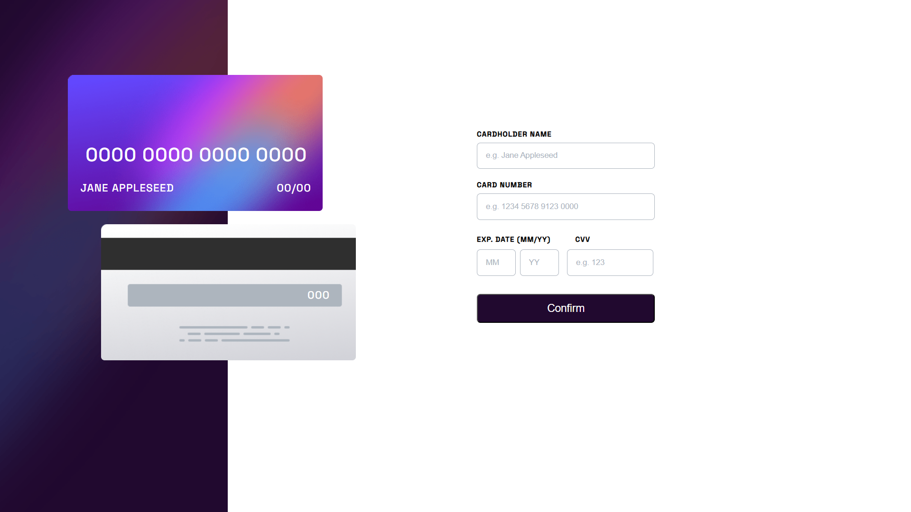
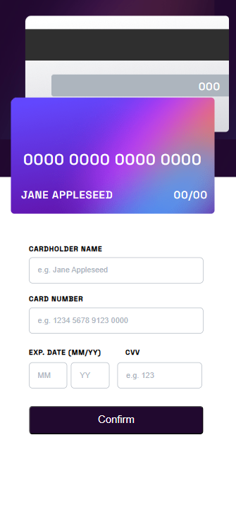

# Frontend Mentor - Interactive card details form solution

Questa è una soluzione al [Interactive card details form challenge on Frontend Mentor](https://www.frontendmentor.io/challenges/interactive-card-details-form-XpS8cKZDWw). Le sfide di Frontend Mentor aiutano a migliorare le capacità di codifica costruendo progetti realistici.

## Table of contents

- [Overview](#overview)
  - [The challenge](#the-challenge)
  - [Screenshot](#screenshot)
- [Built with](#built-with)
- [Author](#author)

## Overview

### The challenge

Gli utenti dovrebbero essere in grado di:

- Compilare il modulo e guardare l'aggiornamento dei dati della carta in tempo reale
- Ricevere messaggi di errore quando il modulo viene inviato e compilato se:
  - Qualsiasi campo di input è vuoto
  - Il numero della carta, la data di scadenza o i campi CVV sono nel formato sbagliato
- Visualizzare il layout ottimale in base alle dimensioni dello schermo del dispositivo

### Screenshot

### Built with

- HTML
- CSS
- Flexbox
- Moduli JavaScript

## Author

- Website - <a href="https://gabrielnissoria.netlify.app/" target="_blank" rel="noopener noreferrer">Sito web dell'autore</a>
- Frontend Mentor - <a href="https://www.frontendmentor.io/profile/Gabriel299" target="_blank" rel="noopener noreferrer">@Gabriel299<a/>
